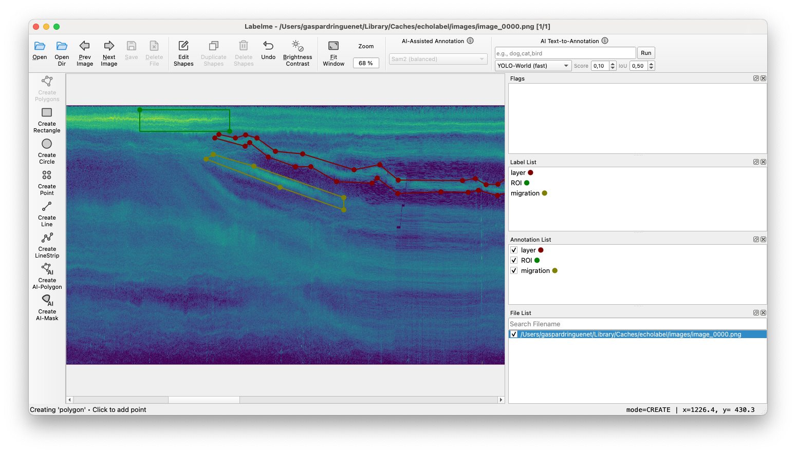

Running demo
============

To run in demo mode, use the ``demo`` subcommand:

.. code-block:: bash

    $ echolabel demo
    Downloading demo data: 100%|███████████████| 25.1M/25.1M [00:02<00:00, 10.6MB/s]
    Processing /Users/gaspardringuenet/Projects/_sandbox/dummy-project/demo.zarr → /Users/gaspardringuenet/Projects/_sandbox/dummy-project/regions.csv
    Building images: 1it [00:00,  3.61it/s]

This program downloads a small dataset in the work directory and runs echolabel with default configuration on this data. 
After converting the data into an echogram image, it opens the Labelme interface, allowing the users to draw shapes.

Shapes are automatically saved by Labelme. To end the annotation session, just close the graphical interface. Shapes [#n1]_ are then parsed
and saved in the ``regions.csv`` file. They can be modified by running the demo again [#n2]_.

.. [#n1] Only polygons and rectangles are supported.
.. [#n2] The demo subcommand integrates an ``--output-dir`` option which defaults to the current work directory. It echolabel will look for both demo.zarr and regions.csv in this directory.

.. _PyPI: https://pypi.org
.. _GitHub: https://github.com/gaspardringuenet/echolabel.git