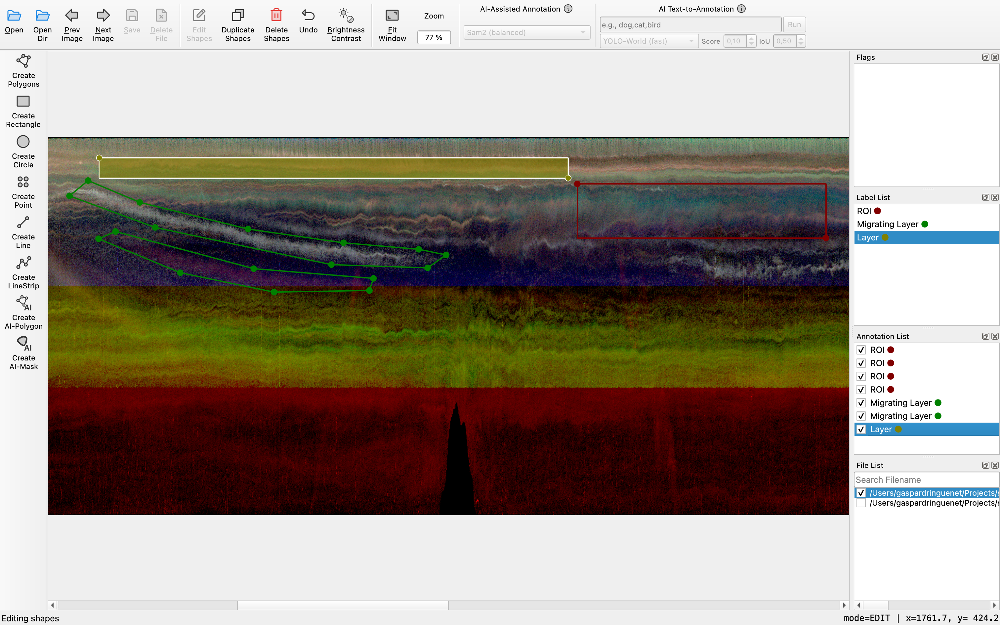

.. echolabel documentation master file, created by
   sphinx-quickstart on Tue Jun  2 18:26:11 2026.
   You can adapt this file completely to your liking, but it should at least
   contain the root `toctree` directive.

Echolabel documentation
=======================

Echolabel is a minimalist Python software designed for easy annotation of marine echogram data. It leverages `Labelme`_ - 
a powerful open-source image annotation software, by converting acoustic data into echogram images, then parsing the output
to real coordinates. Echolabel annotations I/O is carried out using the `Echoregions`_ package, ensuring maximum compatibility
with other marine acoustics pipelines.

.. toctree::
   :maxdepth: 2
   :caption: Contents:

   getting-started
   API Reference <api/echolabel>

Contributors
============

Echolabel is written and maintained by `Gaspard Ringuenet`_.

Indices and tables
==================

* :ref:`genindex`
* :ref:`modindex`
* :ref:`search`

.. _Gaspard Ringuenet: https://github.com/gaspardringuenet
.. _Labelme: https://labelme.io
.. _Echoregions: https://echoregions.readthedocs.io
